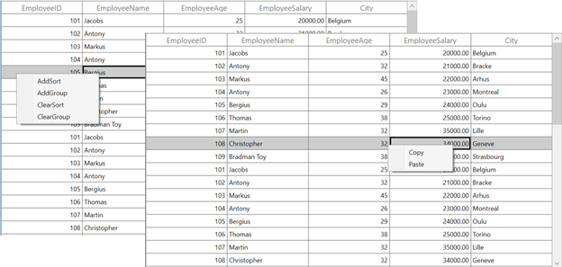

# How to Show Different Context Menu for each Column in WPF DataGrid?
 
[WPF DataGrid](https://www.syncfusion.com/wpf-controls/datagrid) (SfDataGrid) allows you to set different [ContextMenu](https://learn.microsoft.com/en-us/dotnet/api/system.windows.controls.contextmenu?view=netframework-4.7.2) for each column using the [SfDataGrid.GridContextMenuOpening](https://help.syncfusion.com/cr/wpf/Syncfusion.UI.Xaml.Grid.SfDataGrid.html#Syncfusion_UI_Xaml_Grid_SfDataGrid_GridContextMenuOpening) event.

Refer to the following code example to define different ContextMenu for each column based on the column index in **SfDataGrid.GridContextMenuOpening** event. Here, the first three columns have different ContextMenu and the rest of columns have different ContextMenu,

```csharp
this.AssociatedObject.GridContextMenuOpening += AssociatedObject_GridContextMenuOpening;
 
private void AssociatedObject_GridContextMenuOpening(object sender, GridContextMenuEventArgs e)
{
    e.ContextMenu.Items.Clear();
    var columnIndex = this.AssociatedObject.ResolveToGridVisibleColumnIndex(e.RowColumnIndex.ColumnIndex);

    if (columnIndex < 0 && columnIndex >= this.AssociatedObject.Columns.Count)
        return;
    var column = this.AssociatedObject.Columns[columnIndex];
    if (column == null)
        return;

    List<object> commandParameter = new List<object>();
    commandParameter.Add(this.AssociatedObject);
    commandParameter.Add(column);
    CommandBinding binding = new CommandBinding();
    this.AssociatedObject.CommandBindings.Add(binding);

    if (columnIndex < 3)
    {
        e.ContextMenu.Items.Add(new MenuItem()
        {
            Header = "AddSort",
            Command = ContextMenuCommands.AddSort,
            CommandParameter = commandParameter
        });
        e.ContextMenu.Items.Add(new MenuItem()
        {
            Header = "AddGroup",
            Command = ContextMenuCommands.AddGroup,
            CommandParameter = commandParameter
        });
        e.ContextMenu.Items.Add(new MenuItem()
        {
            Header = "ClearSort",
            Command = ContextMenuCommands.ClearSort,
            CommandParameter = commandParameter
        });
        e.ContextMenu.Items.Add(new MenuItem()
        {
            Header = "ClearGroup",
            Command = ContextMenuCommands.ClearGroup,
            CommandParameter = commandParameter
        });
    }
    else 
    {
        e.ContextMenu.Items.Add(new MenuItem()
        {
            Header = "Copy",
            Command = ContextMenuCommands.Copy,
            CommandParameter = commandParameter
        });
        e.ContextMenu.Items.Add(new MenuItem()
        {
            Header = "Paste",
            Command = ContextMenuCommands.Paste,
            CommandParameter = commandParameter
        });
    }
}
```

